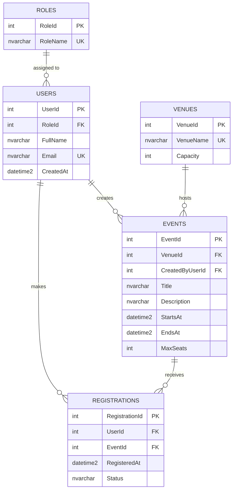

# Online Campus Event Management System

## Team Roster

| Member | Name | Assigned Role | Responsibilities |
|---|---|---|---|
| Member 1 | Keisha Sayoto | Systems Architect & Prompt Lead | Task 1, Task 5 |
| Member 2 | Dominic Silerio | Frontend Engineer | Task 2 |
| Member 3 | Elijah Catoy | Database & Backend Engineer | Task 3 |
| Member 4 | Neil Andrei Lulu | QA & Security Engineer | Task 4 |

## Setup Instructions

1. Clone the repository: `git clone <repository-url>` then `cd campus-events`.
2. Frontend: open `frontend/index.html` in any modern browser. No build step is needed.
3. Database: open `database/schema.sql` in SQL Server Management Studio (or Azure Data Studio) connected to SQL Server and run it.
4. Backend and tests: install the .NET 8 SDK, then run `dotnet test tests/tests.csproj` from the repository root.
5. Refactored service: `backend/RegistrationService.cs`.

## Task 1

### Exact Prompt

```text
Role: You are a Lead Systems Architect with 15 years of experience designing small web applications for universities.

Context: A 3-4 person student team has 3 hours to build a working prototype of an Online Campus Event Management System. Students must be able to view upcoming campus events and register for an event. Administrators must be able to view the registered attendees for each event. The team is at beginner level with generative AI tools. The stack is plain HTML5/CSS/JavaScript for the frontend, C# (.NET 8) for the backend, and SQL Server for the database.

Task: Produce an overall system design containing: (1) a list of functional and non-functional requirements, (2) a layered architecture description, (3) the main modules and their responsibilities, (4) the main data entities, (5) a REST API endpoint list, and (6) a realistic division of work across 4 team members.

Constraints:
- Do not use third-party state management libraries such as Redux.
- Do not propose microservices, message queues, or container orchestration.
- Do not use any frontend framework; use semantic HTML5 and vanilla JavaScript only.
- Keep the design buildable within 3 hours.
- Output in Markdown with headings and one table for the API endpoints.
```

### AI Output

**Functional requirements**
- Students can list upcoming events with date, venue, and seats left.
- Students can register for an event using a university email (@univ.edu.ph).
- The system rejects duplicate registrations and registrations for full events.
- Administrators can view the list of registered attendees per event.

**Non-functional requirements**
- Accessibility to WCAG 2.1 AA basics.
- Parameterized queries only; no secrets in source code.
- Responsive layout for phones and desktops.

**Architecture**
A three-layer monolith: Presentation (static HTML/CSS/JS), Application (ASP.NET Core Web API with service classes for validation and seat availability), and Data (SQL Server accessed through ADO.NET with parameterized commands).

**Modules**
- Frontend: event catalog, registration form, admin attendee table.
- Backend: `EmailDomainValidator`, `SeatAvailabilityService`, `RegistrationService`.
- Database: Roles, Users, Venues, Events, Registrations.

**Data entities**: Role, User, Venue, Event, Registration.

**API endpoints**

| Method | Endpoint | Purpose | Access |
|---|---|---|---|
| GET | /api/events | List upcoming events | Student, Admin |
| GET | /api/events/{id} | Event details and seats left | Student, Admin |
| POST | /api/registrations | Register a user for an event | Student |
| GET | /api/events/{id}/attendees | List attendees of an event | Admin |

**Work split**
- Member 1: prompts, architecture, documentation.
- Member 2: frontend pages and accessibility.
- Member 3: SQL schema and data access.
- Member 4: unit tests and security refactoring.

### Manual Grounding Evaluation

The AI-generated architecture is realistic for a 3-hour prototype because it is a single monolith with three layers, avoids microservices and frameworks, and limits the API to four endpoints. The data model of five tables is small enough to script and test within the time limit. The one risky area is the ASP.NET Core Web API, which adds setup time, so our prototype keeps the frontend working with browser-side data and demonstrates the backend through the service classes and unit tests. The work split also matches the required roles and keeps each member's tasks independent.

## Task 2

Prompt used:

```text
Role: You are a senior frontend engineer specialising in accessible web interfaces.
Task: Build a single-file prototype for a Campus Event Catalog and Registration Form with an admin attendee table.
Constraints: Use semantic HTML5 tags (header, nav, main, section, article, footer) instead of generic div wrappers for page structure. Include aria-label on every input, proper label elements, WCAG AA colour contrast, visible focus styles, alt text on every image, a skip link, and accessible error messages. Use vanilla JavaScript only and no external libraries.
```

Result: `frontend/index.html`.

## Task 3

Prompt used:

```text
Role: You are a senior database engineer.
Task: Design a 3rd Normal Form schema for the Online Campus Event Management System with at least Users, Events, and Registrations. Output (1) the Entity-Relationship Diagram in Mermaid.js erDiagram format and (2) a production-grade SQL Server DDL script.
Constraints: Include primary keys, foreign keys with explicit ON DELETE and ON UPDATE rules, CHECK constraints, UNIQUE constraints, defaults, and non-clustered indexes on every foreign key column.
```

### Mermaid ERD



Script: `database/schema.sql`.

## Task 4

### Unit Test Prompt

```text
Role: You are a QA engineer experienced with xUnit and Moq in C#.
Task: Write unit tests for (1) an email domain validator that only accepts @univ.edu.ph addresses and (2) a seat availability service that depends on an IEventRepository.
Constraints: Use Moq to mock IEventRepository so no database is touched. Cover valid input, invalid input, null and empty input, full events, and invalid event ids. Verify repository calls where relevant.
```

Result: `backend/EmailDomainValidator.cs`, `backend/SeatAvailabilityService.cs`, `tests/ValidationTests.cs`. Run with `dotnet test tests/tests.csproj`.

### Diagnosis Prompt

```text
Role: You are an application security reviewer.
Task: Diagnose the following C# method for SQL injection risks and memory or resource leaks, then explain each issue and how to fix it.
[flawed GetUserRegistration method pasted here]
```

### Diagnosis Result

- SQL injection: `inputEmail` is concatenated into the query string, so an input such as `' OR '1'='1` changes the query logic and can expose every registration.
- Resource leak: `SqlConnection` and `SqlCommand` are never closed or disposed, so connections stay open until garbage collection and the connection pool can be exhausted.
- Hardcoded credentials: the connection string contains a username and password in source code.
- Unsafe return: `ExecuteScalar().ToString()` throws `NullReferenceException` when no row is found.
- Over-fetching: `SELECT *` returns unneeded columns when only one value is read.

### Refactor

Refactored solution: `backend/RegistrationService.cs`. It uses a parameterized `@Email` parameter, `using` declarations for the connection and command, an injected connection string, input validation, and a null-safe return.

## Task 5

### AI Disclosure Statement

We used Claude (Anthropic) to generate the architecture design (Task 1), the frontend prototype (Task 2), the SQL schema and Mermaid ERD (Task 3), and the unit tests and security refactor (Task 4). Every output was reviewed by the responsible member. The frontend was checked in a browser with keyboard-only navigation, the SQL script was executed on SQL Server to confirm it runs without errors, the unit tests were run with `dotnet test`, and the refactored C# was compared line by line against the flawed original. Corrections are listed in the verification log below.

### Group Verification Log

| Task # | Identified AI Flaw / Limitation | Manual Correction Applied | Member Responsible |
|---|---|---|---|
| Task 1 | Architecture suggested an ASP.NET Core API that would take too long to set up in 3 hours | Scoped the prototype so the frontend works standalone and the backend is demonstrated through service classes and tests | Member 1 |
| Task 2 | Input fields relied on placeholders only and had no `aria-label` or linked error messages | Added `aria-label`, `<label for>`, `aria-describedby`, and `role="alert"` error elements | Member 2 |
| Task 3 | Foreign key columns had no supporting indexes and some constraints were unnamed | Added non-clustered indexes on every FK column and named all constraints | Member 3 |
| Task 4 | Refactored code still contained `SELECT *` and did not handle a null result from `ExecuteScalar` | Selected only `RegistrationId`, added null-safe return, and added input validation | Member 4 |
| Task 4 | Email validator accepted `juan@univ.edu.ph.evil.com` style lookalike domains in the first draft | Compared the parsed host to the allowed domain exactly and added a test case | Member 4 |
